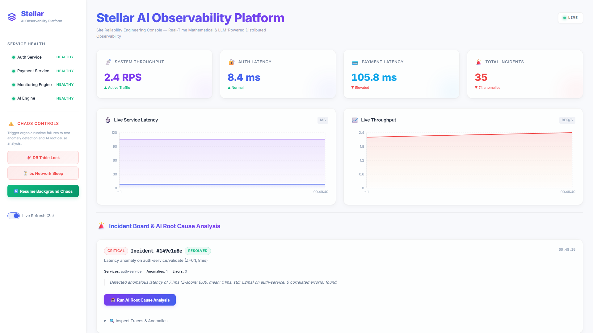
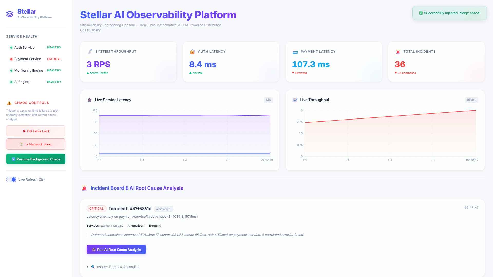
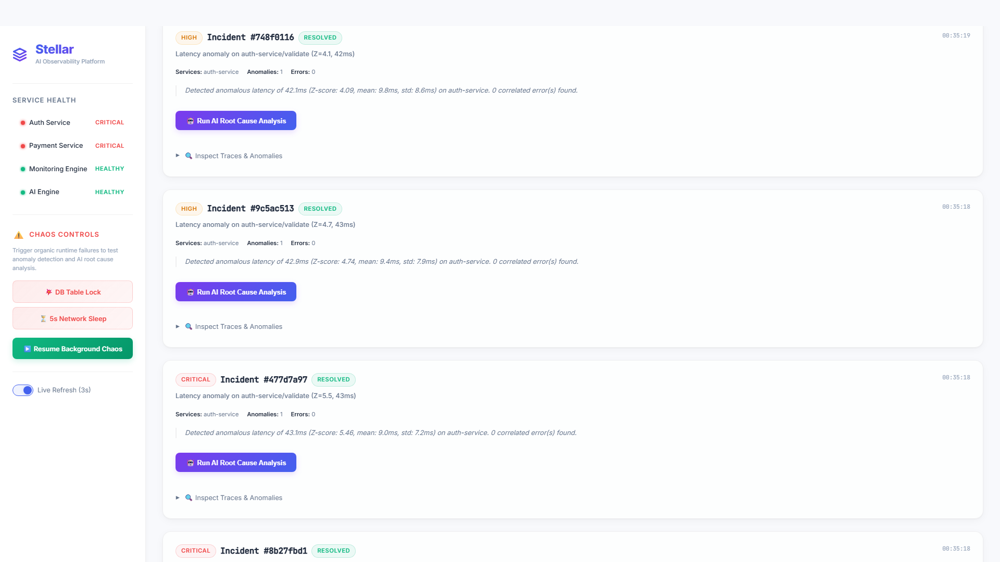
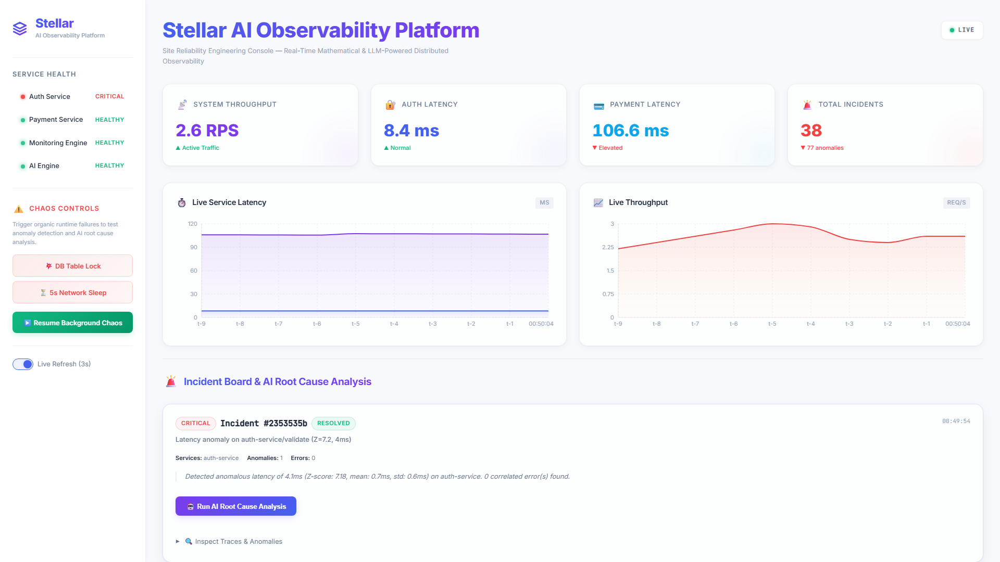
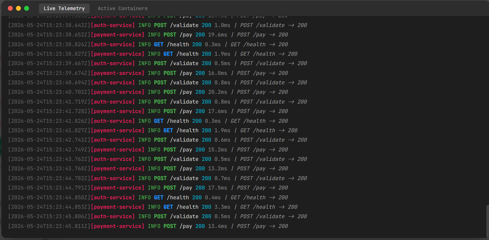
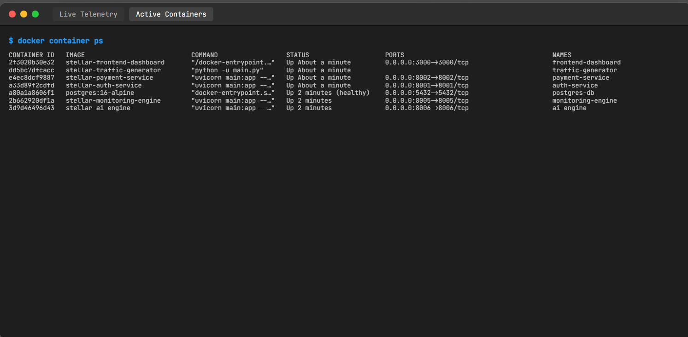
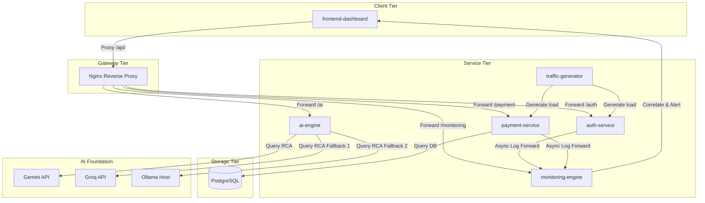

# Stellar AI Observability Platform

**Team Name:** crack_code  
**Team Members:**
* Josh Kumar (`chittetijoshkumar@gmail.com`)
* Sai Sri (`saisrikondaveeti@gmail.com`)

A professional-grade Site Reliability Engineering (SRE) Observability & Mathematical Anomaly Detection Platform. Stellar combines live microservice telemetry ingestion, real-time rolling statistical Z-Score profiling, and a robust 3-tier cloud/local AI diagnostic engine to identify and troubleshoot distributed system incidents instantly.

---

## Platform Showcase

### 1. SRE Observability Console (Nominal State)
A clean, premium console presenting live system-wide throughput, real-time service latencies, and healthy service states.


### 2. Active Anomaly & Sidebar Degradation
When synthetic chaos is injected, affected service dots dynamically shift to critical red/orange in the sidebar in real-time, accompanied by automated telemetry alert charts and an incident card.


### 3. On-Demand SRE Copilot AI diagnostics
Operators can trigger intelligent root cause analysis on demand via an interactive, gradient button, showing detailed logs, blast radius, and remediation plans.


### 4. Incident Healing & Service Restoration
Clicking "✓ Resolve" on the incident card (or waiting for the 15-second background nominal auto-healing loop) immediately resolves active incidents and returns service indicators back to healthy green.


### 5. Live Terminal & Container Observability
An integrated, hacker-themed terminal UI that safely streams combined telemetry from all microservices and displays active container networking. Includes a split-tab interface to instantly switch between streaming Live Telemetry and inspecting Active Containers—all without exposing the massive security risks of mounting the Docker daemon socket.

<p align="center">
  
  &nbsp;
  
</p>

---

## Key Production Features

### 1. Dynamic Reactive Sidebar Health
The sidebar **SERVICE HEALTH** section actively queries open unresolved incidents:
* **Real-time Alerting**: If an active anomaly or error is detected affecting a microservice, the indicator automatically shifts from green `HEALTHY` to a pulsating orange **`DEGRADED`** or red **`CRITICAL`** state.
* **Auto-Healing**: Once incidents are resolved, the service immediately recovers back to a stable green **`HEALTHY`** state.

### 2. Cost-Optimized Manual AI RCA Trigger
* **Throttled Execution**: Avoids the "thundering herd" problem where background loops query the LLM repeatedly. Root cause analysis is triggered manually via interactive CSS-gradient buttons on incident cards.
* **In-Memory Caching (`rcaCache`)**: Restores and renders previously calculated root cause analyses instantly without re-querying, capping background API token costs and local CPU/GPU consumption to **$0.00**.

### 3. Zero-Organic-Anomaly Baseline (Load Throttling)
* **Intelligent Scaling**: When background chaos is stopped, the traffic generator baseline dynamically throttles from **15 RPS down to a gentle 1 RPS**.
* **Nominal Stability**: This removes organic database/CPU queuing contention on local machines, guaranteeing a flat, clean nominal system status while keeping the charts live and ready for manual chaos injection.

### 4. 4-Tier Fallback AI Engine
A highly resilient, multi-tiered AI diagnostic model to guarantee root cause analysis is always available:
1. **Tier 1 (Cloud - Primary)**: Google Gemini API (`gemini-2.0-flash`) for rapid, high-context cloud diagnostics.
2. **Tier 2 (Cloud - High-Speed Fallback)**: Groq Cloud API (`llama-3.1-8b-instant`) utilizing native JSON Mode for sub-second, production-grade cloud diagnostics.
3. **Tier 3 (Local Fallback)**: Native Windows GPU-accelerated Ollama (`llama3.1:8b`) mapped over `host.docker.internal` (avoids heavy 4 GB container pulls).
4. **Tier 4 (Heuristic)**: Offline SRE rules engine that executes instantaneously when all external networks are unavailable.

### 5. Secure Live Terminal Polling
* **Zero-Socket Architecture**: Avoids the critical security vulnerability of mounting `/var/run/docker.sock` to the web by polling the central `monitoring-engine` buffer for real-time logs.
* **Smart Tab UI**: Beautiful tabbed React UI that automatically pauses auto-scrolling when inspecting historical telemetry or switching to active container statuses.

---

## System Architecture



---

## Core Microservices Directory

* **`frontend-dashboard`**: React (Vite + TypeScript) Single Page Application serving as the SRE console.
* **`auth-service`**: FastAPI service handling JWT authentication tokens and structured JSON stdout logging.
* **`payment-service`**: FastAPI payment processor handling SQLAlchemy async PostgreSQL transaction insertions and protecting the `/inject-chaos` endpoint.
* **`monitoring-engine`**: Central telemetry ingestion service that calculates rolling latencies and Z-scores ($Z > 3.0$), matches anomalies to errors, and manages status-healing states.
* **`ai-engine`**: SRE Copilot backend supporting prompt construction, response code-fence parsing, and fallback routing.
* **`traffic-generator`**: Automatic baseline load and background cycle injector.

---

## Getting Started

### Prerequisites
1. **Docker Desktop** installed and running.
2. **Ollama** installed natively on Windows with the **`llama3.1:8b`** model downloaded (`ollama pull llama3.1:8b`).

### Deployment
To compile and launch the entire platform, run the standard Docker command in your project directory:

```bash
docker compose up --build
```

Access the console by opening your browser to:
**`http://localhost:3000`**

*(Remember to press **`Ctrl + F5`** on first load to perform a Hard Refresh and clean out any browser-cached assets!)*
